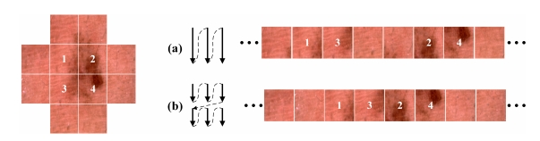
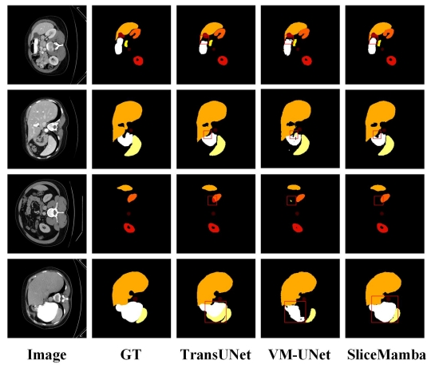
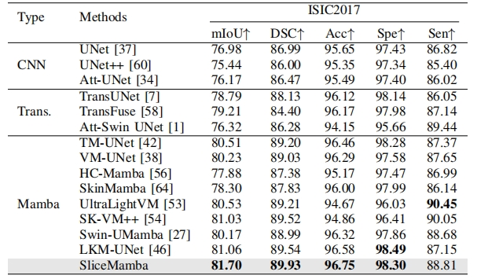
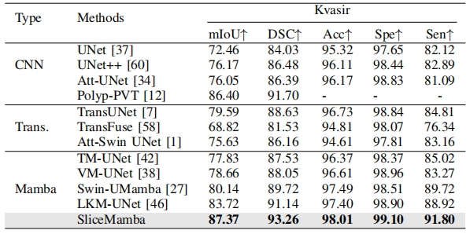

<div align="center">

<h1>SliceMamba 🧠🩺</h1>
<p><em>Neural Architecture Search for Medical Image Segmentation</em></p>

<p>
  <a href="https://ieeexplore.ieee.org/abstract/document/10976597/">
    
  </a>
  
  
  
  
  
</p>

<p>Official PyTorch implementation of the paper "SliceMamba with Neural Architecture Search for Medical Image Segmentation" (IEEE JBHI).</p>



</div>

---

## 🧾 Abstract
Despite the progress made in Mamba-based medical image segmentation models, existing methods utilizing unidirectional or multi-directional feature scanning mechanisms struggle to effectively capture dependencies between neighboring positions, limiting the discriminant representation learning of local features. These local features are crucial for medical image segmentation as they provide critical structural information about lesions and organs. To address this limitation, we propose SliceMamba, a simple yet effective locally sensitive Mamba-based medical image segmentation model. SliceMamba features an efficient Bidirectional Slicing and Scanning (BSS) module, which performs bidirectional feature slicing and employs varied scanning mechanisms for sliced features with distinct shapes. This design keeps spatially adjacent features close in the scan sequence, preserving the local structure of the image and enhancing segmentation performance. Additionally, to fit the varying sizes and shapes of lesions and organs, we introduce an Adaptive Slicing Search method that automatically identifies the optimal feature slicing method based on the characteristics of the target data. Extensive experiments on two skin lesion datasets (ISIC2017 and ISIC2018), two polyp segmentation datasets (Kvasir and ClinicDB), one ultra-wide field retinal hemorrhage segmentation dataset (UWF-RHS), and one multiorgan segmentation dataset (Synapse) demonstrate the effectiveness of our method.

---

## ✨ Highlights
- ✅ Locally sensitive modeling via the Bidirectional Slicing and Scanning (BSS) module that keeps spatial neighbors adjacent in the scan sequence.
- 🔁 Adaptive Slicing Search to automatically select the best slicing strategy for lesion and organ variations.
- 📊 Strong performance across skin lesion (ISIC2017/2018), polyp (Kvasir/ClinicDB), UWF-RHS hemorrhage, and Synapse multiorgan datasets.
- 🧩 Simple, effective, and compatible with common PyTorch toolchains.

---

## 🧠 Method at a Glance


[imgs/method.png](imgs/method.png)

---

## 📸 Qualitative and Quantitative Results


[imgs/result_vis.jpg](imgs/result_vis.jpg)

<div align="center">
  
  
</div>

[imgs/sota_table1.jpg](imgs/sota_table1.jpg) · [imgs/sota_table2.jpg](imgs/sota_table2.jpg)

---

## 🧭 Table of Contents
- [🧾 Abstract](#-abstract)
- [✨ Highlights](#-highlights)
- [🧠 Method at a Glance](#-method-at-a-glance)
- [📸 Qualitative and Quantitative Results](#-qualitative-and-quantitative-results)
- [⚙️ Environment Setup](#️-environment-setup)
- [🗂️ Datasets](#️-datasets)
- [🚀 Quickstart Workflow](#-quickstart-workflow-skin-lesion-example)
- [📁 Project Structure (Key Files)](#-project-structure-key-files)
- [🔖 Citation](#-citation)
- [🤝 Acknowledgements](#-acknowledgements)

---

## ⚙️ Environment Setup
Create and activate the environment, then install dependencies:

- conda create -n slicemamba python=3.8
- conda activate slicemamba
- pip install torch==1.13.0 torchvision==0.14.0 torchaudio==0.13.0 --extra-index-url https://download.pytorch.org/whl/cu117
- pip install packaging
- pip install timm==0.4.12
- pip install pytest chardst yacs termcolor
- pip install submitit tensorboardX
- pip install triton==2.0.0
- pip install causal_conv1d==1.0.0
- pip install mamba_ssm==1.0.1
- pip install scikit-learn matplotlib thop h5py SimpleITK scikit-image medpy yacs

> 💡 Tip: Ensure your CUDA drivers match the CUDA version (11.7) used by the installed PyTorch wheels.

---

## 🗂️ Datasets
Follow VM-UNet instructions to download the skin lesion, polyp, and Synapse datasets:
- https://github.com/JCruan519/VM-UNet?tab=readme-ov-file

---

## 🚀 Quickstart Workflow (Skin Lesion Example)

1) 🔧 Train the supernet
   - Run: python [train.py](train.py)
   - After training completes, the supernet parameters will be saved in the "./results" folder.

2) 🔎 Architecture search based on the trained supernet
   - Run: python [search.py](search.py)
   - After the search is complete, the relevant results will be saved in the "./log_nas" folder.
   - The optimal architecture will be pretrained on ImageNet, following VMamba: https://github.com/MzeroMiko/VMamba

3) 🧪 Retrain and evaluate from scratch
   - Change directory: cd [Evaluation](Evaluation)
   - Run: python [Evaluation/eval.py](Evaluation/eval.py)
   - You will get a dst_folder in evaluation, then
   - Change directory: cd data/**
   - Run: python [train.py](train.py)

---

## 📁 Project Structure (Key Files)
- Core engine: [engine.py](engine.py)
- Training entrypoints: [train.py](train.py), [train_polyp.py](train_polyp.py), [train_synapse.py](train_synapse.py)
- NAS search: [search.py](search.py)
- Evaluation scripts: [Evaluation/eval.py](Evaluation/eval.py)
- Models (SliceMamba UNet): [models/smunet/smunet.py](models/smunet/smunet.py), [models/smunet/supernet_mamba.py](models/smunet/supernet_mamba.py)
- Configs: [configs/config_setting.py](configs/config_setting.py), [configs/config_setting_synapse.py](configs/config_setting_synapse.py)
- Dataset loader: [datasets/dataset.py](datasets/dataset.py)

---

## 🔖 Citation
If you find our work useful, please cite:

```bibtex
@article{fan2025slicemamba,
  title={Slicemamba with neural architecture search for medical image segmentation},
  author={Fan, Chao and Yu, Hongyuan and Huang, Yan and Wang, Liang and Yang, Zhenghan and Jia, Xibin},
  journal={IEEE Journal of Biomedical and Health Informatics},
  year={2025},
  publisher={IEEE}
}
```

---

## 🤝 Acknowledgements
- VMamba pretraining reference: https://github.com/MzeroMiko/VMamba
- VM-UNet dataset preparation: https://github.com/JCruan519/VM-UNet
